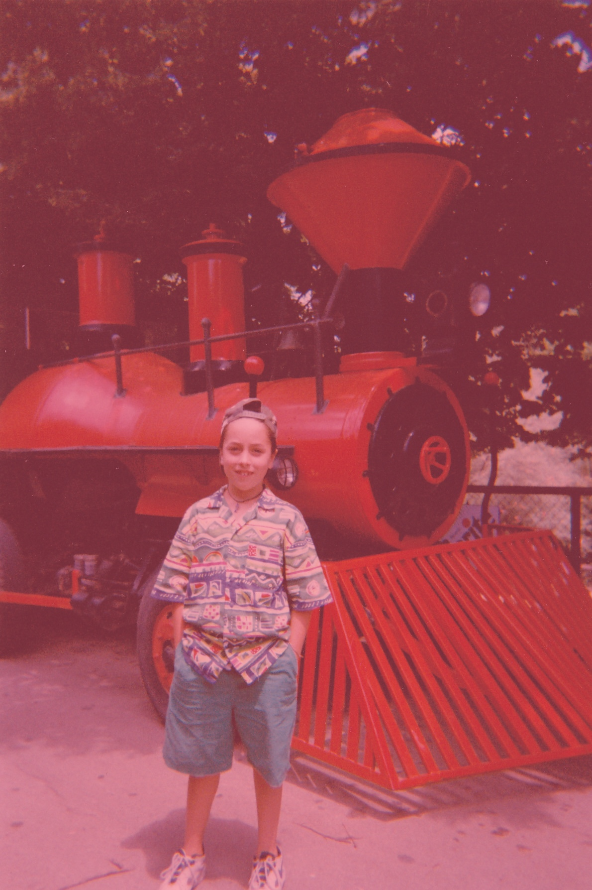

-
-

# [fit] Reinventing **_MobX_**
# __React Live *2019*__
### @_maxgallo 

---

#[fit] Hi
#[fit] I'm __Max__ Gallo

**Principal Engineer** @ DAZN
ITA :airplane: UK

   

twitter: **@\_maxgallo**
more: **maxgallo.io**

---

# | **Agenda** |
-
-

### [fit] >**1** Why Reinvent
### [fit] >**2** Reinvent MobX        
### [fit] >**3** React into the mix             

---

 
 
-
-
-

### [fit] >**1** Why Reinvent

---

# [fit] Take **things**
# [fit] apart

---

# [fit] Take **things**
# [fit] apart

  _**then**_

# [fit] _**Reinvent**_

---

 
 
-
-
-

### [fit] >**2** Reinvent MobX

---

# [fit] Derivation _**Grap„h**_                       

observable __**<<--**__ **reaction**

---

# [fit] Derivation _**Grap„h**_                       

observable __**<<--**__ **reaction**       **observable** __**-->>**__ reaction

---

 
 
-
-
-

### [fit] >**3** React into the Mix

---

 
-
-
-
-
-

# [fit] Observable **changes**   -->>   React Component **render**
-
-
# [fit] :point_up:                      :point_up:
-

# [fit] autorun**(**() => Album**.**render()**)**

[.footer:@_maxgallo]

---

 
 
-
-
-

### [fit] **:heart:** We made it **:heart:** 

---

# [fit] __*>*__ **Disassemble**

## Take things apart to understand what's going on.

--- 

# [fit] __*>*__ **Reinvent**

## Build your own version.

---

# [fit] __*>*__ **Learn**
## Building means learning.

---

# [fit] __*>*__ **Share**
## Tell others what you did.

---

#[fit] **Disassemble** > **Reinvent** > **Learn** > **Share**

twitter **@\_maxgallo**
more **maxgallo.io**

#[fit] Thank __you__

github.com/**maxgallo/talk-reinventing-mobx**

---

# PALETTE

pinkish **FD4C69**
yellow **FFEE4A**
blue **03005D**

lavander D8D4F2
asphalt 474350

---

# Monochrome

:spades: :hearts: :clubs: :diamonds: :scissors: :black_nib: :pencil2: :relaxed: :heart: :v: :point_up: :sunny: :cloud: :snowflake: :a: :b: :o2: :recycle: